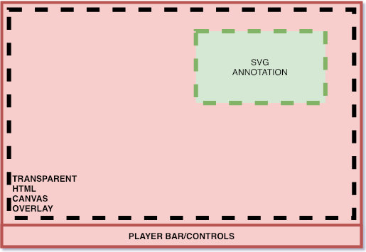

# youtube-annotations-reborn

bring back youtube annotations with a browser extension

## Concept

YouTube has one of the worst developer teams on the market. Either that or they have never seen any user feedback in their entire career at YouTube. Anyhow, apparently their mobile team is so weak that in ~10 years they "never managed to get annotations working on mobile" so they decided the obvious best way to continue from then on was to remove this feature that their own developers can not integrate in their own app.

Anyways, this leaves us today, annotations have been disabled for a while and will be gone for good very soon. A preservation effort is underway with multiple browser extensions that already allow you to backup the annotations XML, which in term could allow for a third-party to reimplement the same feature. This is what this project intends to do: bring back annotations. (**if** you have an XML backup)

## Workings
Here is a rough idea I had that could potentially make this work :

1. Have an XML backup file (manual import | centralised database maybe with alot of luck)
2. Go to video
3. Video matches annotation file that we already imported.
4. Create transparent HTML canvas and overlay it precisely over the video (keep controls out of canvas to be able to click). Make sure that the canvas can scale automatically while always keeping the same aspect ratio (small player, theatre mode, fullscreen canvas should all be same aspect ratio or annotations coordinates wont match)
5. From there its a simple game of adding new SVG elements when needed (@time) and with the required interactivity (click to go to link etc.)

The hardest part will be the canvas system, mainly keeping it overlayed over the player when you scroll, when you change the video size (small/theatre/full etc). Time synchronisation will probably be easy.

## Contributing
I have a lot of work at this moment and might not be able to start on this project straight away. Therefore any contribution is welcomed !
